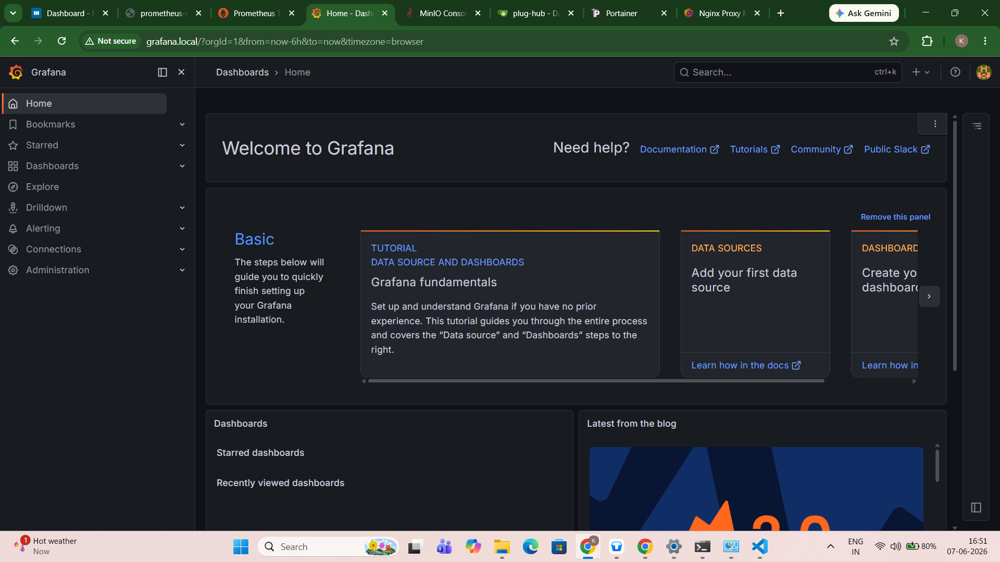
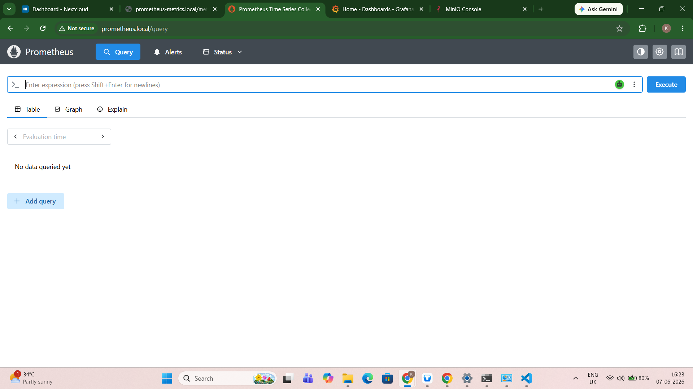
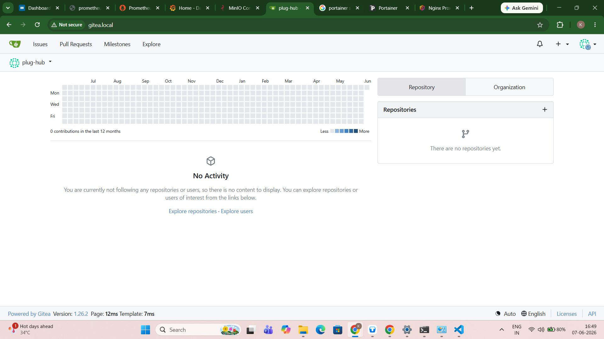
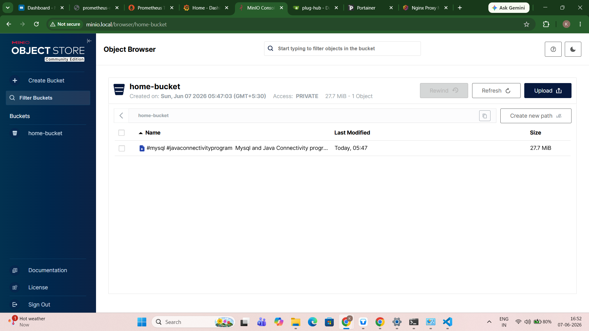
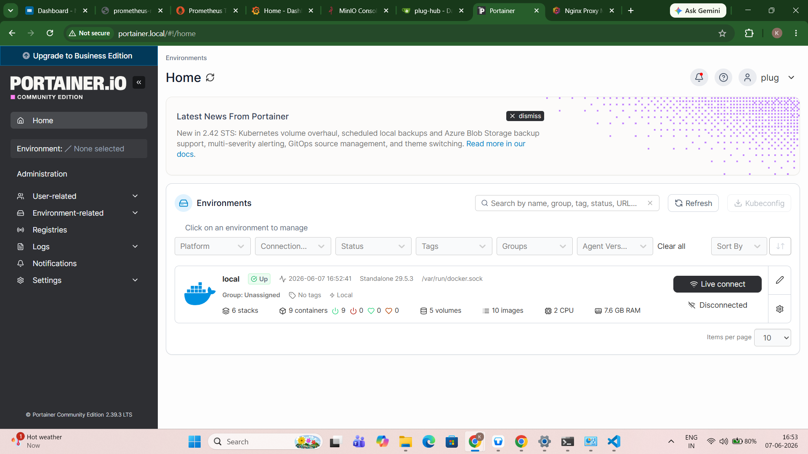
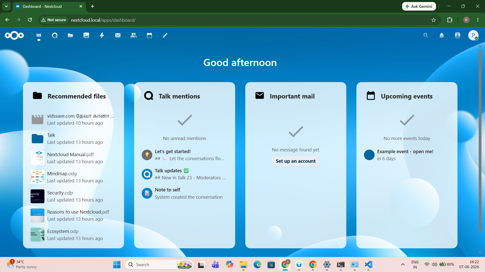
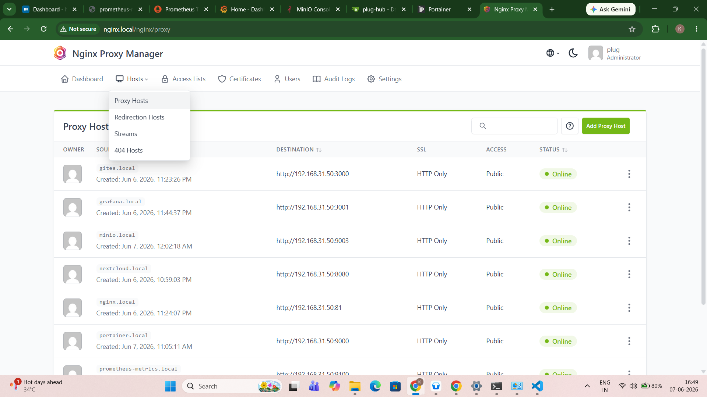
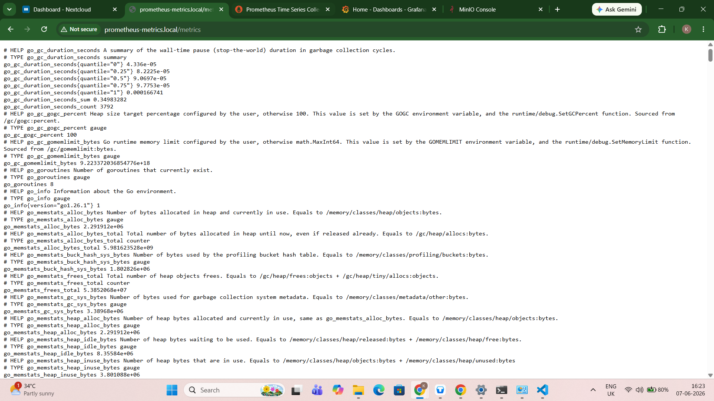

# 🏠 Home Cloud Lab - Mini AWS on an Old Laptop

A self-hosted cloud platform built on an old laptop to learn Linux, Networking, Docker, Monitoring, Storage, DevOps, and Cloud Architecture concepts.

---

## 🎯 Project Goal

Transform an old laptop into a mini cloud platform that mimics core AWS services using open-source tools.

This project is designed for hands-on learning of:

- Linux Administration
- Networking
- DNS
- Reverse Proxy
- Docker
- Monitoring & Observability
- Git Hosting
- Object Storage
- DevOps
- Cloud Infrastructure
- Kubernetes (Future)

---

## 🖥 Hardware

| Component | Specification |
|------------|------------|
| Device | Old Laptop |
| CPU | Intel Pentium B950 |
| Clock Speed | 2.10 GHz |
| RAM | 8 GB |
| Storage | 350 GB HDD |
| OS | Ubuntu Server |
| Network | Jio AirFiber |

---

# 🏗 Architecture

```text
                         Internet
                             │
                      Jio AirFiber
                             │
                      192.168.31.1
                             │
                             ▼
                  ┌──────────────────┐
                  │ Ubuntu Server    │
                  │ 192.168.31.50    │
                  └──────────────────┘
                             │
 ┌─────────────────────────────────────────────────────┐
 │                Infrastructure Layer                 │
 └─────────────────────────────────────────────────────┘

 DNS Layer
 ├── dnsmasq
 │
 ├── nextcloud.local
 ├── gitea.local
 ├── grafana.local
 ├── prometheus.local
 └── minio.local

 Reverse Proxy Layer
 └── Nginx Proxy Manager

 Container Platform
 └── Docker + Portainer

 Application Layer
 ├── Nextcloud
 ├── Gitea
 ├── Grafana
 ├── Prometheus
 ├── Node Exporter
 ├── MinIO
 └── MariaDB
```

---

# 🌐 Networking

## Static IP

```text
IP Address : 192.168.31.50
Gateway    : 192.168.31.1
DNS        : 127.0.0.1
DNS Backup : 8.8.8.8
```

---

## Netplan Configuration

```yaml
network:
  version: 2
  ethernets:
    enp4s0f2:
      dhcp4: no
      addresses:
        - 192.168.31.50/24
      routes:
        - to: default
          via: 192.168.31.1
      nameservers:
        addresses:
          - 127.0.0.1
          - 8.8.8.8
```

Apply:

```bash
sudo netplan apply
```

---

# 🔍 DNS Layer

## dnsmasq

Local DNS service discovery.

### Configuration

```conf
listen-address=127.0.0.1,192.168.31.50
bind-interfaces

address=/nextcloud.local/192.168.31.50
address=/gitea.local/192.168.31.50
address=/grafana.local/192.168.31.50
address=/prometheus.local/192.168.31.50
address=/minio.local/192.168.31.50
```

Restart:

```bash
sudo systemctl restart dnsmasq
```

Test:

```bash
nslookup nextcloud.local
```

---

# 🐳 Docker Platform

## Docker

Container runtime for all services.

Check running containers:

```bash
docker ps
```

---

# 📦 Portainer

Docker management UI.

### Access

```text
https://192.168.31.50:9443
```

---

# 🌍 Reverse Proxy

## Nginx Proxy Manager

Provides:

- Reverse Proxy
- Domain Routing
- SSL Management

### Access

```text
http://192.168.31.50:81
```

---

# ☁️ Nextcloud

Self-hosted Google Drive replacement.

## Stack

```text
Nextcloud
MariaDB
```

## Domain

```text
nextcloud.local
```

## Features

- File Sync
- File Sharing
- Personal Cloud Storage
- Web Access
- Mobile Access

## Trusted Domains

```php
'trusted_domains' =>
array (
  0 => 'localhost',
  1 => '192.168.31.50',
  2 => 'nextcloud.local',
),
```

---

# 🧑‍💻 Gitea

Self-hosted GitHub replacement.

## Domain

```text
gitea.local
```

## Features

- Git Hosting
- Repository Management
- User Management
- SSH Access
- CI/CD Preparation

---

# 📊 Monitoring Stack

## Prometheus

Metrics collection engine.

### Domain

```text
prometheus.local
```

### Metrics

- CPU
- RAM
- Disk
- Network

---

## Node Exporter

System metrics exporter.

Provides:

- CPU Usage
- Memory Usage
- Disk Usage
- Network Traffic

---

## Grafana

Visualization and dashboards.

### Domain

```text
grafana.local
```

### Dashboard

```text
Node Exporter Full
Dashboard ID: 1860
```

### Features

- Monitoring Dashboards
- Infrastructure Analytics
- System Health Tracking

---

# 🪣 MinIO

AWS S3-compatible Object Storage.

### Domain

```text
minio.local
```

### Ports

```text
API      : 9002
Console  : 9003
```

### Features

- Object Storage
- S3 API Compatibility
- Buckets
- Backups
- Cloud-native Storage

---

# 🧠 Nextcloud vs MinIO

## Nextcloud

Human-oriented file storage.

```text
Documents/
Photos/
Videos/
```

Best for:

- Personal Files
- File Sharing
- Synchronization

---

## MinIO

Application-oriented object storage.

```text
Bucket:
backups

Object:
db-backup.tar.gz
```

Best for:

- Backups
- Application Storage
- Cloud-native Workloads
- S3 API Testing

---

# 🗂 Current Services

| Service | Purpose |
|----------|----------|
| Ubuntu Server | Host Operating System |
| Docker | Container Runtime |
| Portainer | Docker Management |
| dnsmasq | DNS Server |
| Nginx Proxy Manager | Reverse Proxy |
| Nextcloud | File Storage |
| MariaDB | Database |
| Gitea | Git Hosting |
| Prometheus | Metrics Collection |
| Grafana | Dashboards |
| Node Exporter | System Monitoring |
| MinIO | Object Storage |

---

# ☁ AWS Mapping

| AWS Service | Home Lab Equivalent |
|-------------|--------------------|
| EC2 | Ubuntu Server |
| Route53 | dnsmasq |
| Application Load Balancer | Nginx Proxy Manager |
| CloudWatch Metrics | Prometheus |
| CloudWatch Dashboards | Grafana |
| S3 | MinIO |
| CodeCommit | Gitea |
| EBS | HDD Storage |
| Systems Manager | Portainer |

---

# 🚀 Future Roadmap

## Observability

- cAdvisor
- Loki
- Alertmanager

## Security

- HTTPS Everywhere
- SSL Certificates
- Authentication Improvements

## Backup

- Restic
- Automated Snapshots
- Offsite Backup

## Container Orchestration

- K3s
- Kubernetes
- GitOps

---

# 📚 Learning Outcomes

This project provides hands-on experience with:

- Linux Administration
- Networking
- DNS
- Reverse Proxy
- Docker
- Monitoring
- Git Hosting
- Object Storage
- DevOps
- Cloud Engineering
- Kubernetes Fundamentals

---

# 🎓 Project Status

✅ Static Networking

✅ Local DNS

✅ Docker

✅ Portainer

✅ Nextcloud

✅ MariaDB

✅ Gitea

✅ Prometheus

✅ Grafana

✅ Node Exporter

✅ MinIO

🔄 cAdvisor

🔄 Loki

🔄 Alertmanager

🔄 K3s

---

## License

This project is for educational and learning purposes.
Built as a personal cloud engineering lab using open-source software.


## Screenshots

## Grafana Dashboard



## Prometheus Dashboard



## Gitea Dashboard



## MinIO Dashboard




## Portainer Dashboard




## Nextcloud Dashboard



## NGINX-Manager Dashboard




## Prometheus-Metrics



